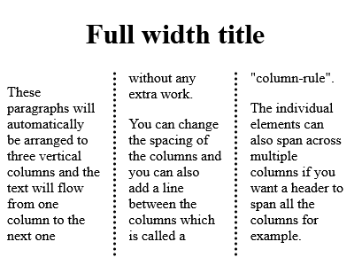

# Tailwindcss-multiple-columns

Plugin for Tailwind CSS that adds support for the multi-column properties

 [](https://github.com/Microwawe/tailwindcss-multiple-columns/blob/master/LICENSE)  [](https://github.com/semantic-release/semantic-release) [](https://github.com/Microwawe/tailwindcss-multiple-columns/issues)
[](https://twitter.com/intent/tweet?text=Wow:&url=https%3A%2F%2Fgithub.com%2FMicrowawe%2Ftailwindcss-multiple-columns)

## CSS Multi-column layout

CSS Multi-column Layout is a module of CSS that adds support for multi-column layouts. Support is included for establishing the number of columns in a layout, as well as how content should flow from column to column, gap sizes between columns, and column dividing lines (known as column rules) along with their appearance. [MDN documentation](https://developer.mozilla.org/en-US/docs/Web/CSS/CSS_Columns).

> NOTE: This has nothing to do with flexbox or CSS grid layouts and their columns. CSS multi-column layout is a completely separate way to create columns of content.

## Installation

### NPM

```sh
npm install tailwindcss-multiple-columns --save-dev
```

### Yarn

```sh
yarn add tailwindcss-multiple-columns -D
```

## Usage

### Configuration

Add the plugin to your `tailwind.config.js` (after you've installed it as described above).

```js
// tailwind.config.js
module.exports = {
  theme: {
    // ..
  },
  variants: {
    // ..
  },
  plugins: [
    // ..
    require('tailwindcss-multiple-columns'),
  ],
};
```

### HTML

Then in your HTML you can use the classes just like any of the default Tailwind CSS classes

```html
<div class="col-count-3 col-rule-dotted col-gap-8">
  <h1 class="col-span-all text-center">Full width title</h1>
  <p>
    These paragraphs will automatically be arranged to three vertical columns and the text will flow
    from one column to the next one without any extra work.
  </p>
  <p>
    You can change the spacing of the columns and you can also add a line between the columns which
    is called a "column-rule".
  </p>
  <p>
    The individual elements can also span across multiple columns if you want a header to span all
    the columns for example.
  </p>
</div>
```

And the result would look like this:



## Features

The following new classes are added in this package:

### Column-count

The `column-count` CSS property breaks an element's content into the specified number of columns.

For more detailed information about which CSS properties can be used with each of these, please refer to the [MDN documentation](https://developer.mozilla.org/en-US/docs/Web/CSS/CSS_Columns).

### License

MIT
